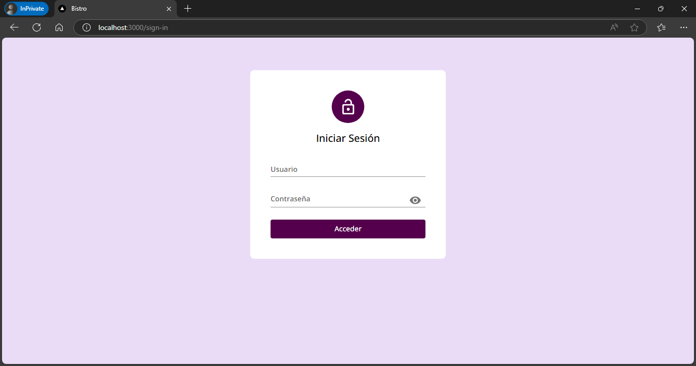
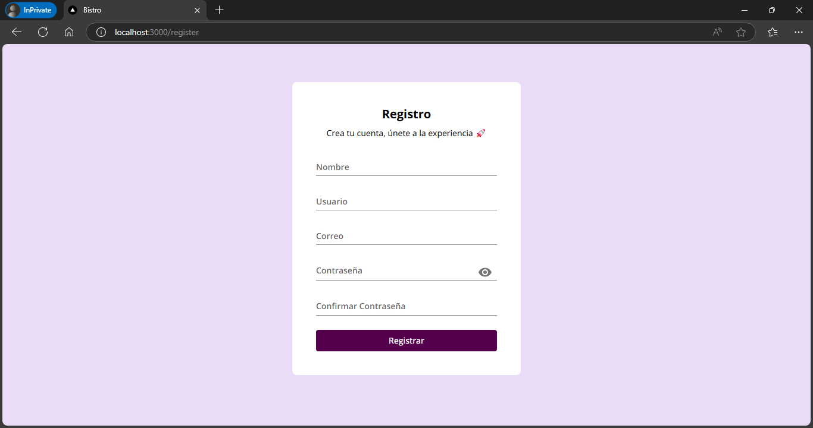
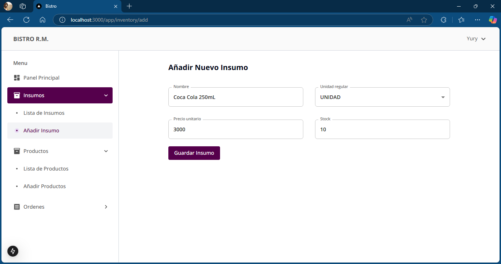
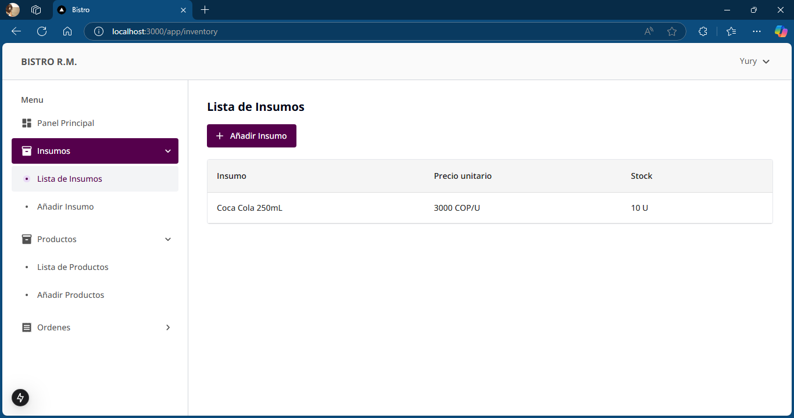
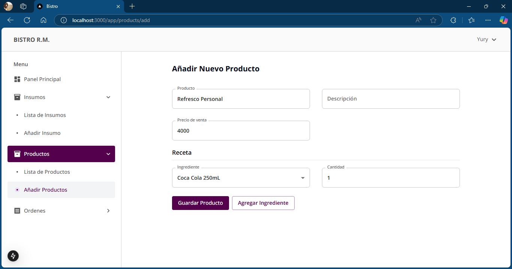
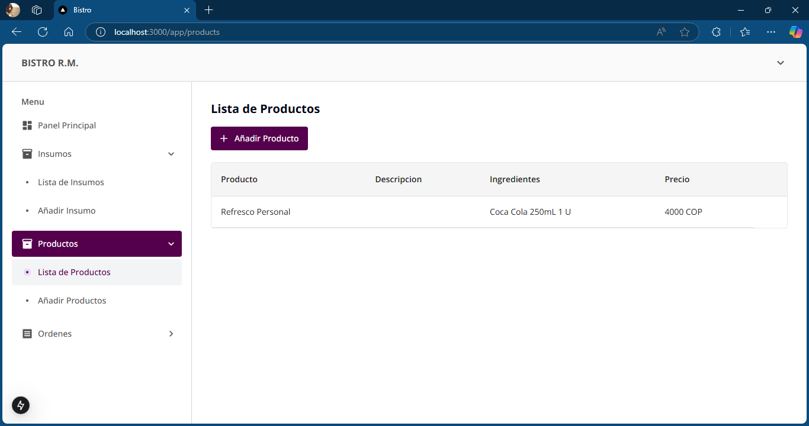
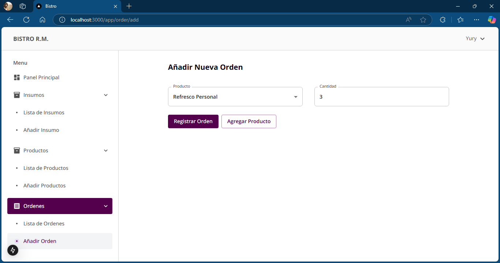
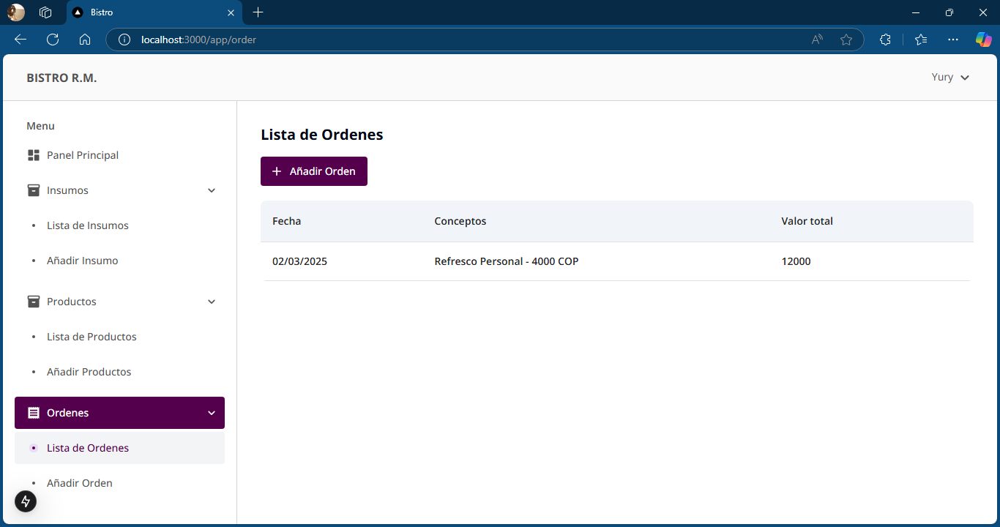

This is a [Next.js](https://nextjs.org/) project bootstrapped with [`create-next-app`](https://github.com/vercel/next.js/tree/canary/packages/create-next-app).

## Mockups

















## Getting Started

First, run the development server:

```bash
npm run dev
# or
yarn dev
# or
pnpm dev
# or
bun dev
```

The package manager initially used was pnpm.

This project uses [`next/font`](https://nextjs.org/docs/basic-features/font-optimization) to automatically optimize and load Inter, a custom Google Font.

## Environment Variables

`NEXTAUTH_URL` https://next-auth.js.org/configuration/options#nextauth_url

`NEXTAUTH_SECRET` Used to encrypt the NextAuth.js JWT https://next-auth.js.org/configuration/options#nextauth_secret

`MONGODB_URI` Allows connecting to MongoDB

`PASS_ENCRYPTION_KEY` Paper for the password hashing

## Learn More

To learn more about Next.js, take a look at the following resources:

- [Next.js Documentation](https://nextjs.org/docs) - learn about Next.js features and API.
- [Learn Next.js](https://nextjs.org/learn) - an interactive Next.js tutorial.

You can check out [the Next.js GitHub repository](https://github.com/vercel/next.js/) - your feedback and contributions are welcome!

## Deploy on Vercel

The easiest way to deploy your Next.js app is to use the [Vercel Platform](https://vercel.com/new?utm_medium=default-template&filter=next.js&utm_source=create-next-app&utm_campaign=create-next-app-readme) from the creators of Next.js.

Check out our [Next.js deployment documentation](https://nextjs.org/docs/deployment) for more details.

## Autor

👤 **Kevin Gomez**  
📧 Email: [kgomezm.dev@gmail.com](mailto:kgomezm.dev@gmail.com)  
🔗 LinkedIn: [linkedin.com/in/kevinandresgom](https://linkedin.com/in/kevinandresgom)  
🐙 GitHub: [github.com/kevinantech](https://github.com/kevinantech)
